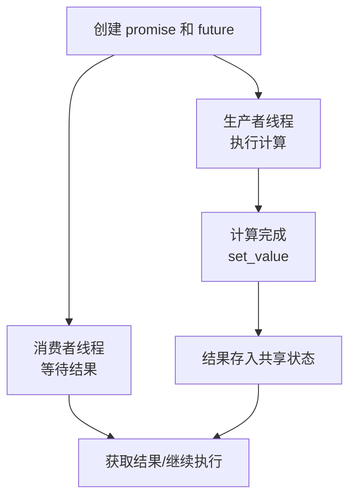

好的，我将为您详细解释 `std::promise`。这是C++并发编程中与 `std::future` 配套使用的一个**生产者-消费者**模型的核心组件。

## 核心概念：承诺与兑现

`std::promise` 可以理解为**结果的承诺方（生产者）**，而 `std::future` 是**结果的接收方（消费者）**。

想象一个场景：
- **承诺方**（promise）："我承诺将来会给你一个值"
- **接收方**（future）："好的，我将来会来取这个值"

## 基本工作原理图



## 基本用法

### 1. 创建和关联
```cpp
#include <iostream>
#include <thread>
#include <future>

int main() {
    // 创建承诺（生产者端）
    std::promise<int> prom;
    
    // 获取与承诺关联的未来（消费者端）
    std::future<int> fut = prom.get_future();
    
    // 现在：
    // prom 是生产者，负责提供值
    // fut 是消费者，负责获取值
    // 两者通过共享状态连接
}
```

### 2. 完整的基本示例
```cpp
#include <iostream>
#include <thread>
#include <future>
#include <chrono>

int main() {
    // 创建承诺
    std::promise<int> result_promise;
    
    // 获取关联的future
    std::future<int> result_future = result_promise.get_future();
    
    // 创建生产者线程
    std::thread producer([&result_promise]() {
        std::cout << "生产者: 开始计算...\n";
        std::this_thread::sleep_for(std::chrono::seconds(2)); // 模拟耗时计算
        
        int result = 42; // 计算结果
        
        std::cout << "生产者: 计算完成，设置结果: " << result << "\n";
        result_promise.set_value(result); // 履行承诺
        std::cout << "生产者: 承诺已履行，退出\n";
    });
    
    // 消费者（主线程）等待结果
    std::cout << "消费者: 等待结果...\n";
    
    // get()会阻塞，直到promise设置值
    int final_result = result_future.get();
    
    std::cout << "消费者: 收到结果 = " << final_result << "\n";
    
    producer.join();
    return 0;
}
```

## 核心成员函数详解

### 1. **设置值：set_value()**
```cpp
std::promise<int> prom;
auto fut = prom.get_future();

std::thread t([&prom] {
    // 单次设置
    prom.set_value(100);
    
    // 再次设置会抛出异常：std::future_error
    // prom.set_value(200); // 错误！
});

int val = fut.get(); // val = 100
t.join();
```

### 2. **设置异常：set_exception()**
```cpp
std::promise<int> prom;
auto fut = prom.get_future();

std::thread t([&prom] {
    try {
        throw std::runtime_error("计算失败！");
    } catch (...) {
        // 捕获异常并传递给future
        prom.set_exception(std::current_exception());
    }
});

try {
    int val = fut.get(); // 这里会抛出runtime_error
} catch (const std::exception& e) {
    std::cout << "捕获异常: " << e.what() << "\n";
}
t.join();
```

### 3. **设置值（移动语义）：set_value() for move-only types**
```cpp
std::promise<std::unique_ptr<int>> prom;
auto fut = prom.get_future();

std::thread t([&prom] {
    auto ptr = std::make_unique<int>(999);
    prom.set_value(std::move(ptr)); // 移动语义
});

std::unique_ptr<int> result = fut.get();
std::cout << *result << "\n"; // 输出: 999
t.join();
```

### 4. **放弃承诺：set_value_at_thread_exit()**
```cpp
std::promise<int> prom;
auto fut = prom.get_future();

std::thread t([&prom] {
    int result = 777;
    
    // 设置值，但只在线程退出时才通知future
    prom.set_value_at_thread_exit(result);
    
    // 这里future还未就绪
    std::cout << "线程: 值已设置但未通知\n";
    std::this_thread::sleep_for(std::chrono::seconds(1));
    std::cout << "线程: 即将退出，此时才通知future\n";
});

std::cout << "主线程: 等待结果...\n";
int val = fut.get(); // 在这里阻塞，直到线程退出
std::cout << "主线程: 收到结果 = " << val << "\n";

t.join();
```

## 高级应用模式

### 模式1：多消费者（shared_future）
```cpp
// promise只能对应一个future，但可以转为shared_future
std::promise<std::string> prom;
std::shared_future<std::string> shared_fut = prom.get_future().share();

// 多个线程可以等待同一个结果
auto consumer1 = std::thread([shared_fut] {
    std::cout << "消费者1: 等待数据...\n";
    std::cout << "消费者1: 收到 = " << shared_fut.get() << "\n";
});

auto consumer2 = std::thread([shared_fut] {
    std::cout << "消费者2: 等待数据...\n";
    std::cout << "消费者2: 收到 = " << shared_fut.get() << "\n";
});

std::this_thread::sleep_for(std::chrono::seconds(1));
prom.set_value("Hello World!");

consumer1.join();
consumer2.join();
```

### 模式2：超时和放弃
```cpp
std::promise<int> prom;
auto fut = prom.get_future();

std::thread worker([&prom] {
    std::this_thread::sleep_for(std::chrono::seconds(5)); // 长时间工作
    prom.set_value(100);
});

// 主线程等待最多2秒
if (fut.wait_for(std::chrono::seconds(2)) == std::future_status::ready) {
    std::cout << "及时完成: " << fut.get() << "\n";
} else {
    std::cout << "超时！\n";
    // 注意：promise仍然会设置值，但我们已经不关心了
    worker.detach(); // 分离线程，让它自己结束
}
```

### 模式3：任务取消
```cpp
class CancellableTask {
    std::promise<int> prom;
    std::atomic<bool> cancelled{false};
    
public:
    std::future<int> get_future() { return prom.get_future(); }
    
    void execute() {
        std::thread([this] {
            for (int i = 0; i < 10 && !cancelled; ++i) {
                std::this_thread::sleep_for(std::chrono::milliseconds(100));
            }
            
            if (cancelled) {
                prom.set_exception(
                    std::make_exception_ptr(std::runtime_error("任务被取消"))
                );
            } else {
                prom.set_value(42);
            }
        }).detach();
    }
    
    void cancel() { cancelled = true; }
};

// 使用
CancellableTask task;
auto fut = task.get_future();
task.execute();

std::this_thread::sleep_for(std::chrono::milliseconds(500));
task.cancel(); // 取消任务

try {
    int result = fut.get();
} catch (const std::exception& e) {
    std::cout << "任务异常: " << e.what() << "\n";
}
```

### 模式4：线程间通信通道
```cpp
template<typename T>
class Channel {
    std::promise<T> sender_prom;
    std::future<T> receiver_fut;
    
public:
    Channel() : receiver_fut(sender_prom.get_future()) {}
    
    // 发送（只能调用一次）
    void send(T value) {
        sender_prom.set_value(std::move(value));
    }
    
    // 接收（阻塞直到有值）
    T receive() {
        return receiver_fut.get();
    }
    
    // 尝试接收（不阻塞）
    bool try_receive(T& value, std::chrono::milliseconds timeout) {
        if (receiver_fut.wait_for(timeout) == std::future_status::ready) {
            value = receiver_fut.get();
            return true;
        }
        return false;
    }
};

// 使用示例
Channel<std::string> chan;

std::thread sender([&chan] {
    std::this_thread::sleep_for(std::chrono::seconds(1));
    chan.send("Hello from sender!");
});

std::thread receiver([&chan] {
    std::string msg = chan.receive();
    std::cout << "收到消息: " << msg << "\n";
});

sender.join();
receiver.join();
```

## 重要注意事项

### 1. **只能设置一次值**
```cpp
std::promise<int> prom;
prom.set_value(1);
// prom.set_value(2); // 抛出 std::future_error
// prom.set_exception(...); // 同样会抛出异常
```

### 2. **生命周期管理**
```cpp
// 错误示例：promise提前销毁
std::future<int> create_future() {
    std::promise<int> prom;  // 局部变量
    auto fut = prom.get_future();
    // 函数返回，prom被销毁，fut无效！
    return fut;  // 错误！
}

// 正确示例：使用shared_ptr管理
std::future<int> create_safe_future() {
    auto prom = std::make_shared<std::promise<int>>();
    auto fut = prom->get_future();
    
    std::thread([prom] {
        prom->set_value(42);
    }).detach();
    
    return fut;  // 正确：prom被线程共享，生命周期延长
}
```

### 3. **异常安全**
```cpp
void process_task(std::promise<int>& prom) {
    try {
        int result = do_risky_operation();
        prom.set_value(result);
    } catch (...) {
        // 必须处理异常，否则程序可能终止
        prom.set_exception(std::current_exception());
    }
}
```

### 4. **与 std::async 对比**
```cpp
// 使用 async（简单，但控制有限）
auto fut1 = std::async([] { return compute(); });

// 使用 promise + thread（完全控制）
std::promise<int> prom;
auto fut2 = prom.get_future();
std::thread([&prom] {
    // 可以控制线程优先级、亲和性等
    set_thread_priority(HIGH);
    prom.set_value(compute());
}).detach();
```

## 实际应用场景

### 场景1：并行计算聚合结果
```cpp
std::vector<std::future<int>> parallel_sum(
    const std::vector<std::vector<int>>& chunks) 
{
    std::vector<std::future<int>> futures;
    
    for (const auto& chunk : chunks) {
        // 为每个块创建promise/future对
        auto prom = std::make_shared<std::promise<int>>();
        futures.push_back(prom->get_future());
        
        std::thread([prom, chunk] {
            int sum = 0;
            for (int num : chunk) sum += num;
            prom->set_value(sum);
        }).detach();
    }
    
    return futures;
}
```

### 场景2：异步I/O操作
```cpp
std::future<std::string> async_read_file(const std::string& filename) {
    auto prom = std::make_shared<std::promise<std::string>>();
    auto fut = prom->get_future();
    
    std::thread([prom, filename] {
        try {
            std::ifstream file(filename);
            std::string content(
                (std::istreambuf_iterator<char>(file)),
                std::istreambuf_iterator<char>()
            );
            prom->set_value(content);
        } catch (...) {
            prom->set_exception(std::current_exception());
        }
    }).detach();
    
    return fut;
}
```

### 场景3：事件通知系统
```cpp
class EventWaiter {
    std::promise<void> event_prom;
    std::future<void> event_fut;
    
public:
    EventWaiter() : event_fut(event_prom.get_future()) {}
    
    void wait_for_event() {
        event_fut.wait();
        // 重新创建新的promise/future对，以便等待下一次事件
        event_prom = std::promise<void>();
        event_fut = event_prom.get_future();
    }
    
    void trigger_event() {
        event_prom.set_value();
    }
};
```

## 总结

`std::promise` 是C++并发编程中**手动控制异步结果**的核心工具：

| 特性 | 说明 |
|------|------|
| **生产者端** | 负责产生结果（值或异常） |
| **与future配对** | 通过 `get_future()` 关联消费者 |
| **一次性设置** | 只能设置一次值或异常 |
| **线程安全** | 可在不同线程安全调用set_value |
| **灵活控制** | 比 `std::async` 提供更多控制权 |

**使用选择指南**：
- 用 `std::async`：简单的异步任务，让编译器管理
- 用 `std::promise`：需要精细控制、自定义线程管理、复杂错误处理
- 用 `std::packaged_task`：包装现有函数，作为任务队列的任务

`std::promise` 提供了最低层的异步结果传递机制，是构建更高级并发抽象（如线程池、任务系统、异步I/O框架）的基础。